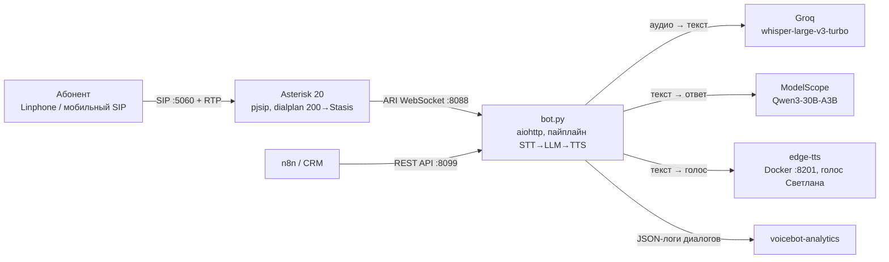
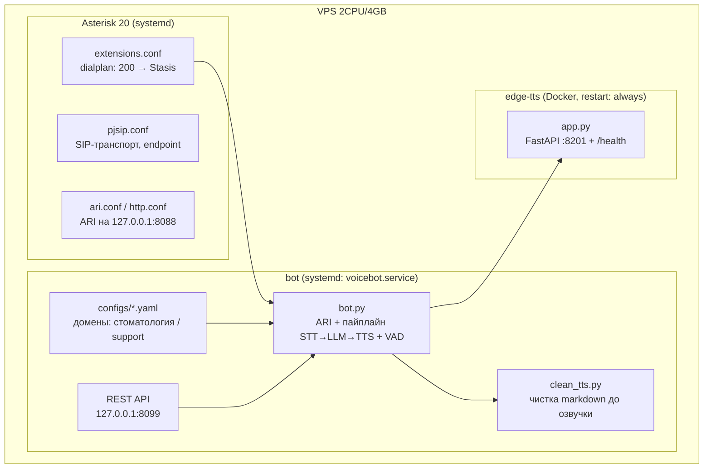
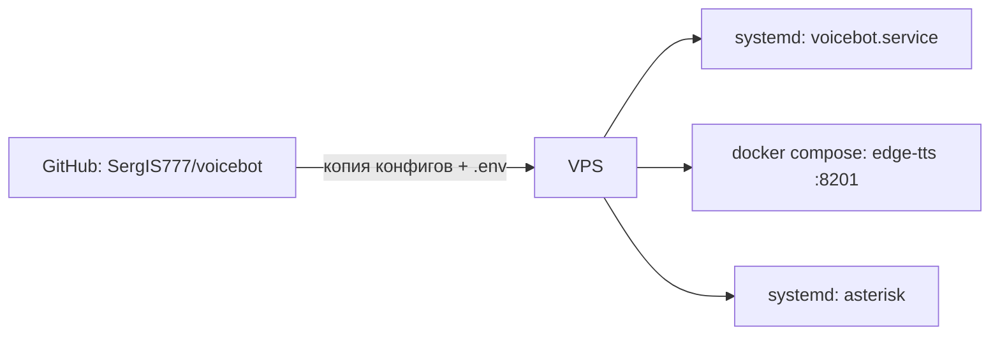

# Architecture — VoiceBot

Документ оформлен по стандарту **arc42** (12 секций), диаграммы — по уровням **C4** в mermaid.

---

## 1. Введение и цели

**VoiceBot** — полноценный телефонный AI-ассистент: принимает SIP-звонки, распознаёт речь, ведёт диалог через LLM и озвучивает ответ живым голосом. Self-hosted, без GPU, на бесплатных тарифах API.

### Топ-3 цели
1. **Zero-cost телефония для малого бизнеса**: автоматизация звонков без платных STT/TTS API и лицензий
2. **Живой разговор**: суммарная задержка ~2.5 с, естественный голос (не роботизированный TTS)
3. **24/7 автономность**: systemd + docker, автоперезапуск, внешнее управление через REST API

### Стейкхолдеры
| Роль | Интерес |
|------|---------|
| Владелец бизнеса | бот принимает звонки 24/7, стоимость ~$0.001/звонок |
| Абонент | живой диалог без «звёздочек» и галлюцинаций |
| Интегратор (n8n / CRM) | REST API для внешнего управления |
| Аналитик | JSON-логи диалогов → voicebot-analytics |

---

## 2. Ограничения архитектуры

- VPS 2 CPU / 4 GB RAM, **без GPU** → LLM только через внешние API
- Free-tier: Groq (STT), ModelScope (LLM) → rate limiting и fallback обязательны
- Телефония self-hosted: Asterisk 20 + pjsip, порты SIP :5060 UDP и RTP :10000-20000 UDP
- Python 3 + aiohttp (асинхронность для одновременных звонков)

---

## 3. Контекст системы (C4 Level 1: Context)

**Бизнес-контекст:** звонок → приветствие → реплика абонента → распознавание → ответ LLM → озвучка → снова слушает, пока абонент не положит трубку.

**Технический контекст:** Asterisk ловит звонок и передаёт в Stasis; бот управляет вызовом по ARI; все сервисы (Groq/ModelScope) — внешние, TTS — локальный контейнер.

---

## 4. Стратегия решений

| Решение | Обоснование | Альтернатива (отклонена) |
|---------|-------------|--------------------------|
| Groq Whisper | ~0.3–0.5 с latency, free tier | OpenAI Whisper API: дороже |
| ModelScope Qwen3-30B | держит контекст, без GPU на VPS | локальная LLM: нет GPU |
| edge-tts в Docker | бесплатно, естественный голос Светлана | ElevenLabs: платно |
| Asterisk 20 + pjsip self-hosted | полный контроль, $0 за телефонию | Twilio/облачная телефония: абонентская плата |
| aiohttp (async) | одновременные звонки без потоков | sync-код: блокировки на каждом звонке |
| Config-driven (YAML) | новый домен (стоматология/support) без кода | хардкод промптов: правка кода на каждый домен |
| systemd + docker | один VPS, простое восстановление | k8s: избыточно для одного хоста |

---

## 5. Структура блоков (C4 Level 2: Container, Level 3: Component)

**Таблица-карта файлов:**
| Файл | Роль | Связан с |
|------|------|----------|
| `bot/bot.py` | главный бот: ARI, VAD, STT→LLM→TTS, защиты, REST API | asterisk/, edge-tts/, configs/, .env |
| `bot/clean_tts.py` | срезает markdown (`**`, `#`, ссылки) до озвучки | bot.py, tests/ |
| `bot/voicebot.service` | systemd-юнит: автозапуск, рестарт при crash | systemd |
| `configs/*.yaml` | системные промпты и настройки доменов без кода | bot.py |
| `asterisk/pjsip.conf` | SIP-транспорт и endpoint | телефон |
| `asterisk/extensions.conf` | dialplan: входящий 200 → Stasis(voicebot) | bot.py |
| `asterisk/ari.conf`, `http.conf` | пользователь ARI, HTTP на 127.0.0.1:8088 | bot.py |
| `asterisk/modules.conf`, `logger.conf` | модули и логирование Asterisk | — |
| `edge-tts/app.py` | FastAPI-обёртка edge-tTS + /health | Docker |
| `edge-tts/Dockerfile`, `docker-compose.yml` | контейнер TTS, restart: always | docker |
| `tests/` | pytest: clean_for_tts и ключевые защиты | CI (.github/workflows) |
| `.github/workflows/` | CI: прогон pytest на каждый push | tests/ |
| `.env.example` | шаблон секретов: GROQ_API_KEY, MODELSCOPE_TOKEN | /root/.voicebot.env (chmod 600) |
| `voicebot.jpeg` | визуальная схема архитектуры для README | README.md |

**Точка входа:** чтение начинай с `bot/bot.py` — цикл разговора собран там; конфиги доменов — в `configs/`.

---

## 6. Runtime-сценарии

**Сценарий 1 — входящий звонок (основной цикл):**
1. Абонент звонит → Asterisk (pjsip) принимает SIP, dialplan 200 → Stasis(voicebot)
2. bot.py подключается по ARI WebSocket, шлёт приветствие (TTS)
3. ARI record пишет реплику абонента → VAD отсекает тишину
4. Groq Whisper распознаёт текст (~0.4 с)
5. Qwen3-30B генерирует ответ (~0.7–1.8 с) с учётом домена из configs
6. `clean_for_tts()` срезает markdown → edge-tts озвучивает → playback
7. Цикл повторяется, пока абонент не положит трубку (hangup → завершение)

**Сценарий 2 — деградация при отказах:**
1. Groq API недоступен / лимит → бот говорит «Сейчас я занят, перезвоните» (graceful degradation)
2. LLM принёс мусор (`http`, `error`, `<html>`) → `is_bad_answer()` бракует → вежливый fallback
3. Whisper сгаллюцинировал на тишине («Субтитры сделал…») → `is_hallucination()` отсекает → бот не озвучивает бред

**Сценарий 3 — внешнее управление:**
1. n8n / CRM шлёт команду на REST API (127.0.0.1:8099)
2. Бот меняет поведение (домен/скрипт) без перезапуска

**Сценарий 4 — падение и восстановление:**
1. bot.py crash → systemd перезапускает (Restart=always)
2. edge-tts crash → docker restart policy поднимает контейнер
3. Диск забит записями → cron удаляет wav старше часа

---

## 7. Деплой и масштабирование

**Портовая карта:**
| Порт | Протокол | Назначение | Доступ |
|------|----------|------------|--------|
| 5060 | UDP | SIP | наружу |
| 10000-20000 | UDP | RTP (голос) | наружу |
| 8088 | HTTP | ARI | только 127.0.0.1 |
| 8099 | HTTP | REST API бота | только 127.0.0.1 |
| 8201 | HTTP | edge-tts | только 127.0.0.1 |

**План масштабирования:**
| Рост | Узкое место | Решение |
|------|-------------|---------|
| больше одновременных звонков | CPU VPS (VAD + запись) | второй VPS: Asterisk отдельно от бота |
| больше TTS-потоков | один контейнер | N контейнеров edge-tts + балансировка |
| локальный LLM | нет GPU | DGX / GPU-сервер + vLLM вместо ModelScope |

**Восстановление с нуля:** конфиги и код — в Git; секреты — по `.env.example`; `cp` конфигов в /etc/asterisk, `systemctl enable --now voicebot`, `docker compose up -d`. Время восстановления — минуты.

---

## 8. Сквозные концепции

- **Config-driven**: промпты и настройки доменов в `configs/*.yaml`, код не трогаем
- **Защиты в глубину**: VAD → is_hallucination → is_bad_answer → clean_for_tts (каждый слой ловит свой класс мусора)
- **Секреты вне кода**: `/root/.voicebot.env` (chmod 600), в репозитории только `.env.example`
- **Служебное не торчит наружу**: ARI, REST API и TTS на 127.0.0.1
- **Наблюдаемость**: JSON-логи диалогов → voicebot-analytics; /health у TTS; journalctl у бота
- **Гигиена диска**: cron-очистка wav старше часа

---

## 9. Архитектурные решения (ADR-lite)

**ADR-1: Asterisk + pjsip self-hosted вместо облачной телефонии.** Полный контроль и $0 абонентской платы; цена — необходимость администрировать Asterisk (приемлемо: конфиги в Git).

**ADR-2: Groq Whisper вместо OpenAI.** Latency 0.3–0.5 с и free tier; ограничение — лимиты, закрыто rate limiting и graceful degradation.

**ADR-3: ModelScope Qwen3-30B вместо локальной модели.** На VPS нет GPU; внешний API даёт 30B-качество бесплатно. Последствия: зависимость от доступности API → fallback-список + честный отказ.

**ADR-4: edge-tts в Docker вместо системного TTS.** Естественный голос Светлана бесплатно; изоляция версий в контейнере.

**ADR-5: config-driven домены.** Стоматология и support описаны YAML-конфигами; новый домен = новый файл, не правка кода.

**ADR-6: systemd вместо оркестратора.** Один VPS — systemd проще и предсказуемее k8s; восстановление = стандартные команды.

---

## 10. Требования к качеству

| Требование | Сценарий | Целевая метрика |
|------------|----------|-----------------|
| Latency | реплика → ответ | ~2.5 с суммарно |
| Стоимость | один звонок | ~$0.001 (free tier) |
| Доступность | crash любого сервиса | автоперезапуск, 24/7 |
| Качество речи | LLM принёс markdown/мусор | TTS не читает «звёздочку» |
| Безопасность | PII и ключи | секреты в .env, сервисы на 127.0.0.1 |
| Тестируемость | правка clean_for_tts / защит | pytest + CI (badge: passing) |

---

## 11. Риски и технический долг

**Риски:**
- Урежут free-tier Groq/ModelScope (403) → митигация: fallback-список моделей + вежливый отказ вместо галлюцинаций
- edge-tts поменяет API → митигация: версия зафиксирована в Dockerfile
- Одновременные звонки упрутся в CPU → митигация: план разнесения по VPS (секция 7)

**Осознанные решения (не «недоделки»):**
- Тесты покрывают `clean_for_tts` и ключевые защиты (CI зелёный); телефонный цикл проверяется production-звонками — юнит-тестами ARI не закрыть
- Нагрузочное тестирование не добавлено: нагрузка ограничена телефонным трафиком одного номера
- Часть настроек живёт в словаре `settings` в bot.py рядом с configs — перенос в YAML постепенный, по мере добавления доменов

---

## 12. Глоссарий

| Термин | Значение |
|--------|----------|
| SIP / RTP | протоколы сигнализации и голоса в телефонии |
| pjsip | SIP-стек Asterisk |
| Stasis | режим Asterisk, где вызовом управляет внешнее приложение по ARI |
| ARI | Asterisk REST Interface (WebSocket + HTTP) |
| VAD | Voice Activity Detection — отсечение тишины |
| STT / TTS | Speech-to-Text / Text-to-Speech |
| Config-driven | бизнес-правила в YAML, код не меняется |
| Graceful degradation | при отказе API бот вежливо отшивается, а не молчит |

---

## Как менять этот проект

| Хочу… | Куда идти |
|-------|-----------|
| новый домен (скрипт бота) | `configs/*.yaml` |
| новая защита от мусора | `bot/bot.py` (is_bad_answer / is_hallucination) + tests/ |
| другой голос / тембр | `edge-tts/app.py` + настройки TTS |
| порты и транспорт | `asterisk/*.conf` + таблица портов (секция 7) |
| автозапуск / рестарт | `bot/voicebot.service` |
| секретные ключи | `/root/.voicebot.env` (шаблон — `.env.example`) |

После правки: коммит в GitHub → копировать изменённые файлы на VPS → `systemctl restart voicebot`. Телефония и REST API оживают без пересборки.
