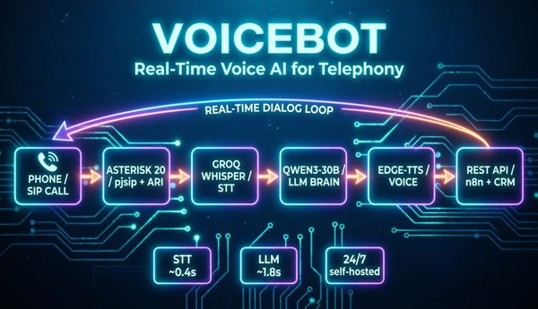

# 🎙️ VoiceBot — голосовой AI-ассистент для телефонии

  

---



---

## 📚 **Полная архитектурная документация** (arc42 + C4): [ARCHITECTURE.md](ARCHITECTURE.md)

---

Полноценный телефонный AI-бот: принимает вызовы по SIP...

Полноценный телефонный AI-бот: принимает вызовы по SIP, распознаёт речь,
отвечает через LLM и озвучивает ответ живым голосом. Собран на бесплатных
тарифах API. Управляется извне через REST API (для n8n / CRM / автоматизаций).

---

## Как это работает

```
Телефон (Linphone / мобильный SIP)
        │  SIP :5060 (UDP) + RTP :10000-20000
        ▼
   Asterisk 20 (pjsip)  ── dialplan: 200 -> Stasis(voicebot)
        │  ARI WebSocket :8088
        ▼
   bot.py (Python, aiohttp)
        ├── STT  → Groq  whisper-large-v3-turbo
        ├── LLM  → ModelScope  Qwen3-30B-A3B-Instruct-2507
        └── TTS  → edge-tts (Docker, голос Светлана)
```

---

**Цикл разговора:** Asterisk ловит звонок → передаёт в Stasis → бот отвечает
приветствием → записывает реплику (ARI record) → VAD отсекает тишину →
Groq распознаёт текст → Qwen генерирует ответ → edge-tts озвучивает → бот
снова слушает. И так по кругу, пока абонент не положит трубку.

---

## Возможности
- 📞 Приём SIP-звонков (Asterisk 20 + pjsip + ARI)
- 🗣️ Распознавание речи — Groq Whisper (~0.3–0.5 c)
- 🧠 Диалог — Qwen3-30B (держит контекст, ~0.7–1.8 c)
- 🔊 Озвучка — Microsoft edge-tts, голос Светлана (бодрый тембр)
- 🎚️ VAD — отсечение тишины и пауз
- 🛡️ Защиты: фильтр мусорных ответов LLM, чистка markdown перед озвучкой,
  фильтр STT-галлюцинаций, детект прощания, дневной бюджет токенов
- ⚙️ systemd-сервис: автозапуск, рестарт при падении
- 🧹 cron-очистка записей (диск не засоряется)
- 🔌 REST API для внешнего управления (n8n, CRM, автоматизации)

---

## Стек
Asterisk 20 · pjsip · ARI · Python 3 · aiohttp · Groq API · ModelScope API ·
edge-tts · Docker · systemd

---

## Установка

### 1. Зависимости
```bash
sudo apt update
sudo apt install -y asterisk python3-aiohttp docker.io docker-compose ffmpeg
```
---

### 2. Asterisk
Скопируй конфиги из `asterisk/` в `/etc/asterisk/`, подставь свои пароли
(вместо `YOUR_SIP_PASSWORD` / `YOUR_ARI_PASSWORD`), создай каталог записей:
```bash
sudo cp asterisk/*.conf /etc/asterisk/
sudo mkdir -p /var/spool/asterisk/recording
sudo chown asterisk:asterisk /var/spool/asterisk/recording
sudo systemctl restart asterisk
```
---

### 3. edge-tts (Docker)
```bash
cd edge-tts && docker compose up -d --build
curl http://localhost:8201/health   # {"status":"healthy"}
```
---

### 4. Бот
```bash
cp bot/bot.py bot/clean_tts.py /root/
cp .env.example /root/.voicebot.env   # и впиши реальные ключи
chmod 600 /root/.voicebot.env
cp bot/voicebot.service /etc/systemd/system/
sudo systemctl daemon-reload
sudo systemctl enable --now voicebot
journalctl -u voicebot -f             # ждём "ARI connected. Waiting for calls..."
```
---

## Конфигурация
Ключи — в `/root/.voicebot.env` (см. `.env.example`):
- `GROQ_API_KEY` — для STT (https://console.groq.com)
- `MODELSCOPE_TOKEN` — для LLM (https://modelscope.cn)

Параметры голоса, модели, VAD, бюджета — в словаре `settings` в `bot.py`.

---

## Управление
```bash
systemctl status voicebot          # статус
systemctl restart voicebot         # перезапуск
journalctl -u voicebot -f          # логи в реальном времени
docker ps                          # контейнеры
crontab -l                         # очистка wav
```

---

## Защиты
Бот не читает «звёздочки», не озвучивает галлюцинации Whisper,
вежливо отшивается при падении API и не тратит токены на тишину.
Как устроен каждый механизм (is_bad_answer, clean_for_tts, is_hallucination, VAD, дневной бюджет) — [ARCHITECTURE.md, секции 6 и 8](ARCHITECTURE.md#8-сквозные-концепции).

---

## Troubleshooting
| Симптом | Причина / фикс |
|---|---|
| `Record fail: Internal Server Error` | нет каталога `/var/spool/asterisk/recording` — создать + `chown asterisk` |
| `TTS edge err` | контейнер edge-tts не поднят — `docker compose up -d` |
| `Stasis app 'voicebot' not registered` | бот не запущен — `systemctl status voicebot` |
| односторонний звук | RTP-порты 10000-20000/UDP закрыты файрволом |
| бот читает «звёздочки» | не применена `clean_for_tts` |

---

## Лицензия
MIT

---

## Стек проекта
- **Телефония:** Asterisk 20 · pjsip · ARI (Stasis)
- **Бот:** Python 3 · aiohttp · REST API
- **AI:** Groq Whisper (STT) · ModelScope Qwen3-30B (LLM) · edge-tts (TTS)
- **Инфраструктура:** Docker · systemd · Linux/VPS · cron

## Автор: **Сергей Исаков** 

## Резюме на hh.ru  https://spb.hh.ru/resume/cabaf8c9ff07eccd210039ed1f4b75515a6f56

## Связаться с автором проекта sergeyhigh@gmail.com

## Связанные проекты: 
- **https://github.com/SergIS777/ml-loop**
- **https://github.com/SergIS777/voicebot-analytics**
- **https://github.com/SergIS777/multi-agent-rag**

---
